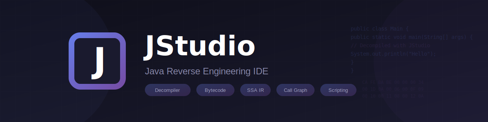
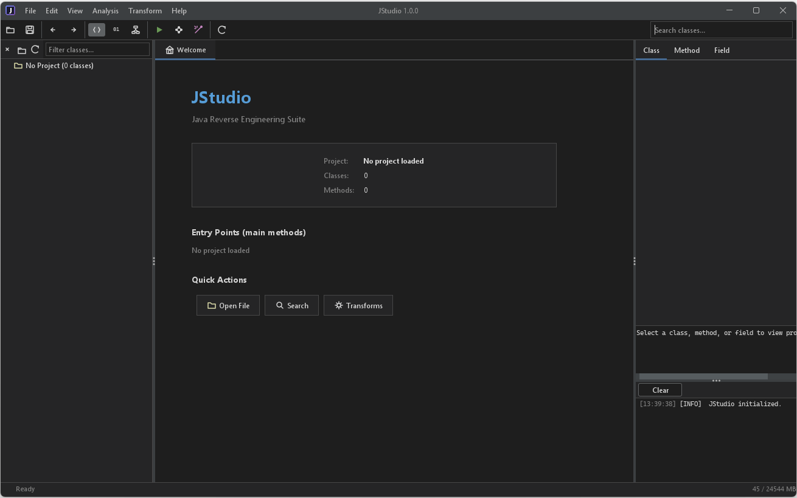

A Java reverse engineering and static analysis IDE for analyzing, decompiling, and transforming Java bytecode.

Powered by [YABR](https://github.com/Tonic-Box/YABR)

## Features

### Multi-View Code Editor
- **Source View** - Decompiled Java with syntax highlighting
- **Bytecode View** - Disassembled JVM instructions with color-coded opcodes
- **IR View** - SSA-form intermediate representation
- **Hex View** - Raw class file bytes

### Analysis Tools
- **Call Graph** - Visual method call hierarchies
- **Dependencies** - Class dependency visualization
- **Cross-References** - Bidirectional symbol reference tracking
- **Data Flow** - SSA-based data flow analysis
- **Similarity** - Method duplicate detection
- **String Extraction** - Constant pool string search
- **Usages** - Find method calls, field accesses, allocations

### Code Transformation
- **SSA Transforms** - Apply static single assignment optimizations with before/after preview
- **Custom Scripting** - Built-in scripting language for AST and IR manipulation

### UI
- Tabbed editor with multiple views per class
- Navigator tree with package hierarchy
- Properties panel for class/method/field metadata
- Console with multi-level logging
- 8 built-in themes (dark and light)

## Building & Running

### Quick Start
```bash
./gradlew run              # Run the application directly
./gradlew build            # Compile + test + create fat JAR
```

### Distribution
```bash
./gradlew shadowJar        # Create fat JAR only
java -jar build/libs/JStudio.jar
```

### Development
```bash
./gradlew clean build      # Fresh build
./gradlew refreshDependencies build  # Force refresh SNAPSHOT deps
```

## Usage

1. **Open a project**: File → Open (Ctrl+O) to load a JAR, directory, or class file
2. **Navigate**: Use the class tree on the left to browse packages and classes
3. **View code**: Double-click a class to open it, use View menu to switch between Source/Bytecode/IR/Hex
4. **Analyze**: Use Analysis menu for call graphs, dependencies, cross-references, etc.
5. **Transform**: Use Scripting menu to open the script editor for custom transformations

## Keyboard Shortcuts

| Action | Shortcut |
|--------|----------|
| Open Project | Ctrl+O |
| Source View | F5 |
| Bytecode View | F6 |
| IR View | F7 |
| Find in Files | Ctrl+Shift+F |
| Go to Class | Ctrl+Shift+N |
| Increase Font | Ctrl++ |
| Decrease Font | Ctrl+- |

## Dependencies

- [FlatLaf](https://www.formdev.com/flatlaf/) - Modern Swing look and feel
- [RSyntaxTextArea](https://github.com/bobbylight/RSyntaxTextArea) - Syntax highlighting
- [JGraphX](https://github.com/jgraph/jgraphx) - Graph visualization
- [JavaParser](https://javaparser.org/) - Java parsing
- [YABR](https://github.com/Tonic-Box/YABR) - Bytecode analysis framework

## License

MIT
